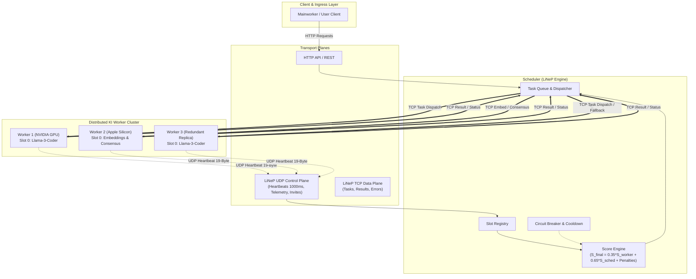
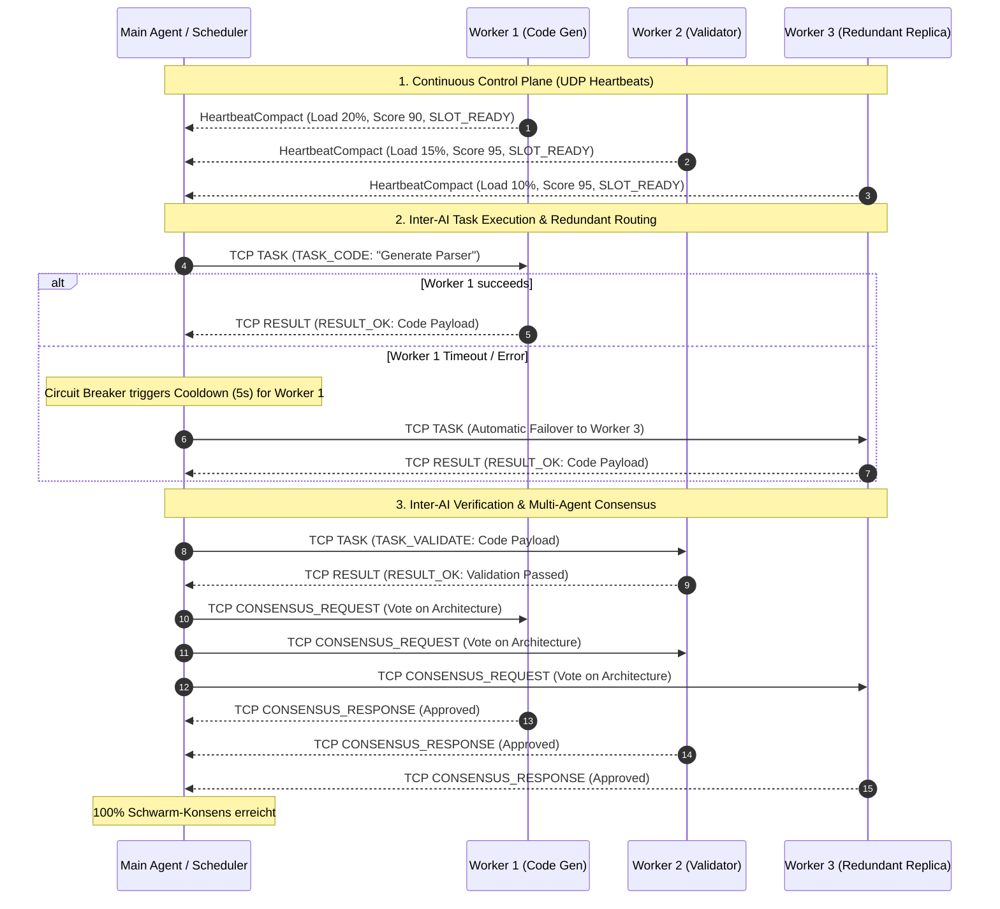

# LiNeP

```text
██╗     ██╗███╗   ██╗███████╗███████╗
██║     ██║████╗  ██║██╔════╝██╔═══██╗
██║     ██║██╔██╗ ██║█████╗  ███████╔╝
██║     ██║██║╚██╗██║██╔══╝  ██╔════╝
███████╗██║██║ ╚████║███████╗██║ 
╚══════╝╚═╝╚═╝  ╚═══╝╚══════╝╚═╝ 
    LiNeP - Liara Neural Protocol
```

**LiNeP — Liara Neural Protocol** | C++17 | CMake 3.20+ | zero external dependencies

Aktuelle Entwicklungs-Baseline (nicht abwaertskompatibel): siehe [PROTOCOL_V0_1_0.md](PROTOCOL_V0_1_0.md)
Mac Testpartner Referenz (C/C++ plus Python): siehe [REFERENCE_V0_1_0_MAC.md](REFERENCE_V0_1_0_MAC.md)

Binäres Netzwerk-Protokoll für die Liara-KI-Inferenz-Infrastruktur.  
Worker-Knoten melden sich beim Scheduler an, senden periodische Heartbeats und
tauschen Inferenz-Aufträge (TASK / RESULT) über TCP aus.

---

## Inhaltsverzeichnis

1. [Protokollüberblick](#1-protokollüberblick)
2. [Wire-Format](#2-wire-format)
3. [Message-Typen](#3-message-typen)
4. [Frame-Flags](#4-frame-flags)
5. [Fehler-Codes](#5-fehler-codes)
6. [Projektstruktur](#6-projektstruktur)
7. [Module](#7-module)
8. [Scheduler](#8-scheduler)
9. [Public API](#9-public-api)
10. [Build](#10-build)
11. [Cross-Compile](#11-cross-compile)
12. [Tests](#12-tests)
13. [Design-Entscheidungen](#13-design-entscheidungen)
14. [Python-Paket](#14-python-paket-)
15. [linep-doctor](#15-linep-doctor)

---

## 1  Protokollüberblick

| Transport | Verwendung |
|-----------|------------|
| **UDP** | HeartbeatCompact (19 Bytes: Präsenz, Slot-Status, Last, Score, UTC Timestamp, CRC-8), Control Pings, INVITE / ACK |
| **TCP** | Inferenz-Aufträge: TASK → RESULT / ERROR, REGISTER, BYE, EMBED, SIMILARITY, CONSENSUS |

```
Worker / Coworker                              Scheduler
  │──── REGISTER (TCP) ──────────────────────────▶│
  │◀─── REGISTER_ACK ─────────────────────────────│
  │                                               │
  │════ HeartbeatCompact (UDP, 1000ms ± 10%) ════▶│  jede Sekunde
  │◀─── INVITE / HEARTBEAT_ACK (UDP) ──────────────│  Control Acks
  │                                               │
  │──── TASK (TCP) ──────────────────────────────▶│  Auftrag annehmen
  │◀─── RESULT / MSG_ERROR ───────────────────────│  Ergebnis zurückgeben
  │                                               │
  │──── BYE (TCP) ───────────────────────────────▶│  Geordnetes Trennen
```

### 1.1  Systemarchitektur (Mainworker ↔ Scheduler ↔ Coworker)



### 1.2  Inter-AI Communication & Redundanz-Konzept

LiNeP unterstützt neben dem klassischen Inferenz-Dispatching auch die **direkte Kommunikation zwischen KI-Systemen (Agent-to-Agent / Model-to-Model)**:

* **Spezialisierung (`TaskType`)**: Routing von Aufgaben an KI-Spezialisten (`TASK_CODE`, `TASK_INSTRUCT`, `TASK_SUMMARIZE`, `TASK_VALIDATE`, `TASK_EDGE_TEXT_EVAL`).
* **Vektor-Austausch (`EMBED_*` / `SIMILARITY_*`)**: Direct-Passing von hochdimensionalen Embeddings ohne Konvertierungsverluste.
* **Schwarm-Konsens (`CONSENSUS_*`)**: Abstimmungsverfahren zwischen mehreren KI-Agenten zur Vermeidung von Halluzinationen.
* **Redundanz & Automatic Failover**: Gleiche Modelle laufen auf mehreren Worker-Knoten. Fällt ein Worker aus, schaltet die Score Engine per Cooldown in Millisekunden auf den nächsten gesunden Replika-Knoten um.



---

## 2  Wire-Format

### 2.1  Common Header — 24 Bytes (TCP)

| Offset | Bytes | Feld           | Beschreibung |
|--------|-------|----------------|--------------|
| 0      | 2     | `magic`        | `0x4C4E` ("LN") |
| 2      | 1     | `version`      | `0x01` |
| 3      | 1     | `msg_type`     | `linep::MsgType` |
| 4      | 2     | `header_len`   | `24` (v1.0) oder `30` mit BuildTime-Extension |
| 6      | 2     | `flags`        | Bit-Feld, s. [§4](#4-frame-flags) |
| 8      | 4     | `payload_len`  | Bytes nach dem Header |
| 12     | 4     | `sequence`     | Sender-lokaler Zähler |
| 16     | 4     | `correlation_id` | Request ↔ Response Zuordnung |
| 20     | 2     | `worker_id`    | Sender-Worker |
| 22     | 1     | `slot_id`      | Sender-Slot |
| 23     | 1     | `header_crc`   | CRC-8 über Bytes [0..22] |

Gefolgt von `payload_len` Bytes Nutzlast.

### 2.1.1  Header v1.1 — BuildTime Extension (6 Bytes)

LiNeP trennt **Protocol-Version** und **Implementierungs-Buildzeit**.

- `version` bleibt für Wire-Kompatibilität bei `0x01`.
- Build-Zeit wird optional als Header-Erweiterung übertragen.
- Aktivierung über `FLAG_BUILD_TIME` (Bit 10).

Wenn `FLAG_BUILD_TIME` gesetzt ist, gilt:

- `header_len = 30`
- 6 Byte folgen direkt nach dem 24-Byte-Basisheader:

| Offset ab Header-Start | Bytes | Feld | Beispiel |
|------------------------|-------|------|----------|
| 24 | 1 | `year_2d` | `0x1A` (= 2026) |
| 25 | 1 | `month`   | `0x05` |
| 26 | 1 | `day`     | `0x01` |
| 27 | 1 | `hour`    | `0x0D` |
| 28 | 1 | `minute`  | `0x2A` |
| 29 | 1 | `second`  | `0x0F` |

Beispiel `2026-05-01 13:42:15 UTC` → `1A 05 01 0D 2A 0F`.

Hinweis zur Kompatibilität:

- Receiver akzeptieren `header_len >= 24`.
- Unbekannte Zusatzbytes können übersprungen werden.

### 2.2  HeartbeatCompact — 12 Bytes (UDP)

| Offset | Bytes | Feld           | Beschreibung |
|--------|-------|----------------|--------------|
| 0      | 2     | `magic`        | `0x4C4E` |
| 2      | 1     | `version`      | `0x01` |
| 3      | 1     | `msg_type`     | `0x01` (HEARTBEAT) |
| 4      | 2     | `worker_id`    | |
| 6      | 1     | `slot_id`      | |
| 7      | 1     | `slot_flags`   | `SlotFlags`-Bitmask |
| 8      | 1     | `load`         | 0–100 %, `0xFF` = offline |
| 9      | 1     | `queue_depth`  | 0–254, `0xFF` = overflow |
| 10     | 1     | `sequence`     | wraps at 255 |
| 11     | 1     | `crc8`         | CRC-8 über Bytes [0..10] |

### 2.3  Byte-Reihenfolge & CRC

- **Byte-Reihenfolge:** Little-Endian (Wire-Format)
- **CRC:** CRC-8, Poly `0x07`, Init `0x00`, keine Reflektion

---

## 3  Message-Typen

| Wert | Konstante        | Transport | Beschreibung |
|------|------------------|-----------|--------------|
| 0x01 | `HEARTBEAT`      | UDP       | Kompakter Präsenz-Ping |
| 0x02 | `REGISTER`       | TCP       | Worker meldet sich an |
| 0x03 | `REGISTER_ACK`   | TCP       | Scheduler-Bestätigung |
| 0x04 | `BYE`            | TCP       | Geordnetes Trennen |
| 0x10 | `TASK`           | TCP       | Inferenz-Auftrag |
| 0x11 | `TASK_ACK`       | TCP       | Auftrag angenommen |
| 0x12 | `RESULT`         | TCP       | Inferenz-Ergebnis |
| 0x13 | `MSG_ERROR`      | TCP       | Fehler-Antwort |
| 0x20 | `STATUS_REQUEST` | TCP       | Status abfragen |
| 0x21 | `STATUS_RESPONSE`| TCP       | Status-Antwort |
| 0x30 | `EMBED_REQUEST`  | TCP       | Embedding-Anfrage |
| 0x31 | `EMBED_RESPONSE` | TCP       | Embedding-Antwort |
| 0x32 | `SIMILARITY_REQUEST` | TCP  | Ähnlichkeitssuche |
| 0x33 | `SIMILARITY_RESPONSE`| TCP  | Ähnlichkeits-Antwort |
| 0x40 | `CONSENSUS_REQUEST`  | TCP  | Konsens-Abstimmung |
| 0x41 | `CONSENSUS_RESPONSE` | TCP  | Konsens-Ergebnis |
| 0xF0 | `PING`           | TCP       | Verbindungstest |
| 0xF1 | `PONG`           | TCP       | Verbindungstest-Antwort |

### Task-Typen (`TaskType`)

| Wert | Konstante              |
|------|------------------------|
| 0x01 | `TASK_INSTRUCT`        |
| 0x02 | `TASK_CODE`            |
| 0x03 | `TASK_SUMMARIZE`       |
| 0x04 | `TASK_CLASSIFY`        |
| 0x05 | `TASK_VALIDATE`        |
| 0x06 | `TASK_EDGE_TEXT_EVAL`  |

### Result-Status (`ResultStatus`)

| Wert | Konstante              | Bedeutung |
|------|------------------------|-----------|
| 0x00 | `RESULT_OK`            | Erfolg |
| 0x01 | `RESULT_REJECTED`      | Auftrag abgelehnt |
| 0x02 | `RESULT_TIMEOUT`       | Zeitüberschreitung |
| 0x03 | `RESULT_MODEL_ERROR`   | Modell-interner Fehler |
| 0x04 | `RESULT_INVALID_INPUT` | Ungültige Eingabe |
| 0x05 | `RESULT_DEGRADED`      | Ergebnis degradiert |

---

## 4  Frame-Flags

16-Bit-Feld im Common Header (`flags`):

| Bit | Konstante            | Beschreibung |
|-----|----------------------|--------------|
| 0   | `FLAG_ACK_REQUIRED`  | Empfänger muss bestätigen |
| 1   | `FLAG_IS_ACK`        | Dieses Frame ist eine ACK |
| 2   | `FLAG_ERROR`         | Nutzlast enthält Fehler-Antwort |
| 3   | `FLAG_COMPRESSED`    | *(reserviert v1)* |
| 4   | `FLAG_ENCRYPTED`     | *(reserviert v1)* |
| 5   | `FLAG_FRAGMENTED`    | Frame ist Teil einer Sequenz |
| 6   | `FLAG_FINAL_FRAGMENT`| Letztes Fragment |
| 7   | `FLAG_PRIORITY`      | Bevorzugte Verarbeitung |
| 8   | `FLAG_DEGRADED`      | Sender im Degraded-Modus |
| 9   | `FLAG_RETRY`         | Wiederholungs-Versuch |

### Slot-Flags (`slot_flags` im Heartbeat)

| Bit | Konstante       |
|-----|-----------------|
| 0   | `SLOT_ALIVE`    |
| 1   | `SLOT_READY`    |
| 2   | `SLOT_BUSY`     |
| 3   | `SLOT_DEGRADED` |
| 4   | `SLOT_ERROR`    |

---

## 5  Fehler-Codes

`ErrorCode` (16-Bit, in MSG_ERROR-Nutzlast, Bytes 0–1):

| Bereich | Codes | Beschreibung |
|---------|-------|--------------|
| Protokoll | 1000–1004 | `ERR_PROTOCOL_ERROR`, `ERR_CRC_ERROR`, `ERR_UNSUPPORTED_VERSION`, `ERR_UNKNOWN_MSG_TYPE`, `ERR_INVALID_PAYLOAD` |
| Modell | 2000–2004 | `ERR_MODEL_NOT_READY`, `ERR_MODEL_LOAD_FAILED`, `ERR_INFERENCE_FAILED`, `ERR_TOKENIZER_FAILED`, `ERR_DEVICE_UNAVAILABLE` |
| Infrastruktur | 3000–3002 | `ERR_TIMEOUT`, `ERR_NO_SLOT_AVAILABLE`, `ERR_CONSENSUS_FAILED` |

MSG_ERROR-Nutzlast-Layout:

```
[0..1]  ErrorCode  (uint16_t, little-endian)
[2..]   Klartext-Grund (UTF-8, optional, nicht null-terminiert)
```

---

## 6  Projektstruktur

```
liara-linep/
├── CMakeLists.txt              Root-CMake: aggregiert alle OBJECT-Libs zur linep.dll/.a
├── cmake/
│   └── toolchains/
│       ├── linux-arm64.cmake   aarch64-linux-gnu-gcc Cross-Compile
│       ├── linux-x64.cmake     Native Linux x64
│       └── windows-arm64.cmake MSVC ARM64 Cross-Compile
├── include/
│   └── linep/
│       ├── export.h            LINEP_API-Makro (dllexport/import/visibility)
│       ├── types.hpp           Wire-Format-Structs + Enums (öffentliche API)
│       └── messages.hpp        MsgType, ErrorCode, ResultStatus, TaskType, …
├── src/
│   ├── pal/                    Platform Abstraction Layer (intern)
│   │   ├── socket.hpp          Plattformunabhängiges Socket-API
│   │   ├── socket_win.cpp      Winsock2-Implementierung
│   │   ├── socket_posix.cpp    POSIX-BSD-Sockets-Implementierung
│   │   ├── clock.hpp           Monotone Uhr + sleep_ms
│   │   ├── clock_win.cpp       QueryPerformanceCounter
│   │   ├── clock_posix.cpp     clock_gettime(CLOCK_MONOTONIC)
│   │   ├── byteorder.hpp       to_le16/32/float (no-op auf x64/ARM64)
│   │   └── CMakeLists.txt
│   ├── core/                   Framing + Integrität (intern)
│   │   ├── crc.hpp / crc.cpp   CRC-8 (Poly 0x07, Init 0x00)
│   │   ├── framing.hpp / .cpp  make_*/validate_* für Header + HeartbeatCompact
│   │   └── CMakeLists.txt
│   ├── udp/                    UDP-Heartbeat
│   │   ├── heartbeat.hpp       IHeartbeatSender / IHeartbeatReceiver (pure virtual)
│   │   ├── heartbeat.cpp       Impl mit std::thread (versteckt hinter DLL-Grenze)
│   │   └── CMakeLists.txt
│   ├── tcp/                    TCP-Aufgaben-Kanal (Stub, nächste Iteration)
│   │   ├── tcp_stub.cpp
│   │   └── CMakeLists.txt
│   └── scheduler/              Multi-Worker-Scheduler
│       ├── slot_registry.hpp   SlotKey, SlotState, apply_heartbeat(), expire_slot()
│       ├── score_engine.hpp    is_eligible(), score_slot(), select_best_slot()
│       ├── score_engine.cpp    Score-/Filter-/Cooldown-Implementierungen
│       ├── task_queue.hpp      PendingTask, ActiveTask, ResultCallback
│       ├── scheduler.hpp       IScheduler (pure virtual) + Factory
│       ├── scheduler.cpp       SchedulerImpl: Loop, Dispatch, Retry, Cooldown
│       └── CMakeLists.txt
└── tests/
    ├── CMakeLists.txt
    ├── sched_helper.hpp                            Shared helper — make_good_slot()
    ├── test_crc.cpp
    ├── test_heartbeat_compact.cpp
    ├── test_register_frame.cpp
    ├── test_task_send_receive.cpp
    ├── test_result_parsing.cpp
    ├── test_error_frame_handling.cpp
    ├── test_crc_fail_reject.cpp
    ├── test_timeout_detection.cpp
    ├── test_slot_state_update_from_heartbeat.cpp
    ├── test_scheduler_selects_lowest_score.cpp
    ├── test_scheduler_ignores_not_ready.cpp
    ├── test_scheduler_ignores_error_slot.cpp
    ├── test_scheduler_ignores_stale_slot.cpp
    ├── test_scheduler_prefers_lower_queue.cpp
    ├── test_scheduler_applies_busy_penalty.cpp
    ├── test_scheduler_applies_degraded_penalty.cpp
    ├── test_scheduler_cooldown_after_timeout.cpp
    ├── test_scheduler_retries_on_second_worker.cpp
    └── test_scheduler_rejects_when_no_slot_available.cpp
```

---

## 7  Module

### PAL — Platform Abstraction Layer (`src/pal/`)

Kapselt alle plattformspezifischen APIs. Nach außen wird ausschließlich das
plattformunabhängige Interface `socket.hpp` / `clock.hpp` verwendet.

| Symbol | Beschreibung |
|--------|--------------|
| `pal::Socket` | Opakes Handle (`uintptr_t` Win, `int` POSIX) |
| `pal::net_init() / net_cleanup()` | WSAStartup / WSACleanup (no-op auf POSIX) |
| `pal::udp_open()` | UDP-Socket öffnen |
| `pal::udp_bind(s, port)` | An lokalen Port binden |
| `pal::udp_set_recv_timeout(s, ms)` | SO_RCVTIMEO setzen |
| `pal::udp_sendto(s, host, port, buf, len)` | UDP senden |
| `pal::udp_recvfrom(...)` | UDP empfangen, 0 = Timeout, <0 = Fehler |
| `pal::tcp_connect(host, port, timeout_ms)` | TCP-Verbindung aufbauen |
| `pal::tcp_listen(port, backlog)` | TCP-Server-Socket |
| `pal::tcp_accept(server)` | Client-Verbindung annehmen |
| `pal::tcp_send_all / tcp_recv_all` | Vollständige Puffer senden/empfangen |
| `pal::socket_close(s)` | Socket schließen |
| `pal::clock_ms() / clock_us()` | Monotone Uhr |
| `pal::sleep_ms(ms)` | Blockierendes Warten |

### Core (`src/core/`)

| Symbol | Beschreibung |
|--------|--------------|
| `core::crc8(data, len)` | CRC-8, Poly `0x07`, Init `0x00` |
| `core::make_heartbeat_compact(...)` | HeartbeatCompact erzeugen + CRC setzen |
| `core::validate_heartbeat_compact(f)` | Magic / Version / CRC prüfen |
| `core::make_header(...)` | Common Header erzeugen + CRC setzen |
| `core::validate_header(h)` | Magic / Version / header_len / CRC prüfen |

### UDP-Heartbeat (`src/udp/`)

Die öffentlichen Klassen sind **pure virtual** — keine STL-Typen an der DLL-Grenze.

```cpp
// Sender
IHeartbeatSender* tx = linep::udp::create_heartbeat_sender(worker_id, slot_id);
tx->start("192.168.1.10", 9001, /*interval_ms=*/ 1000);
tx->set_status(SLOT_ALIVE | SLOT_READY, /*load=*/30, /*queue=*/2);
// ...
tx->stop();
linep::udp::destroy_heartbeat_sender(tx);

// Empfänger
IHeartbeatReceiver* rx = linep::udp::create_heartbeat_receiver();
rx->start(9001, [](const HeartbeatCompact& f, const char* ip, uint16_t port, void*) {
    // f.worker_id, f.load, f.slot_flags …
}, nullptr);
// ...
rx->stop();
linep::udp::destroy_heartbeat_receiver(rx);
```

Interner Ablauf:
- Sender schläft in 50-ms-Ticks (`udp_set_recv_timeout` nicht benötigt); reagiert sofort auf `stop()`.
- Receiver setzt `SO_RCVTIMEO = 500 ms`; prüft `running_`-Flag bei jedem Wakeup.
- Korrupte Frames (CRC-Fehler, falsches Magic/Version) werden **stillschweigend verworfen**.

---

## 8  Scheduler

### 8.1  Übersicht

```text
Scheduler
├─ UDP Heartbeat Listener   (extern, via IHeartbeatReceiver → apply_heartbeat())
├─ Slot Registry            (SlotState pro Worker/Slot)
├─ Score Engine             (is_eligible + score_slot → select_best_slot)
├─ Task Queue               (PendingTask / ActiveTask)
├─ TCP Task Dispatcher      (pro Task ein dedizierter std::thread)
├─ Result Collector         (inline im Dispatch-Thread)
└─ Timeout / Cooldown       (handle_failure + cooldown_for)
```

### 8.2  Scheduler-Loop (intern)

```cpp
while (running) {
    expire_stale_slots();    // Heartbeat-Timeout → alive/ready/load=OFFLINE
    dispatch_pending();      // snapshot → select_best_slot → Thread-Launch
    wait_for_tasks(10ms);    // condition_variable, weckt sofort bei submit()
}
```

### 8.3  Slot-Lifecycle

```text
[register_slot]          → SlotState erzeugt (ip + tcp_port gesetzt)
[apply_heartbeat]        → flags / load / queue / last_heartbeat aktualisiert
[expire_stale_slots]     → nach > 5 s ohne Heartbeat: alive=false
[select_best_slot]       → is_eligible() + score_slot() → bester SlotKey
[dispatch: busy=true]    → Task-Thread läuft
[Erfolg: busy=false]     → success_count++
[Fehler: busy=false]     → timeout_count++ + cooldown_until gesetzt
```

### 8.4  Hard-Filter (`is_eligible`)

Ein Slot wird **niemals** ausgewählt, wenn:

| Bedingung | Grund |
|-----------|-------|
| `!alive` | Slot hat sich nicht gemeldet |
| `!ready` | Modell nicht bereit |
| `error` | Slot im Fehlerzustand |
| `model_loading` | Modell lädt noch |
| `thermal_limit` | Thermische Drosselung |
| `load >= 90` | CPU/NPU überlastet |
| `queue_depth >= 8` | Warteschlange voll |
| `last_heartbeat + 5 s < now` | Stale — kein Lebenszeichen |
| `now < cooldown_until` | Aktuell gesperrt nach Fehler |

### 8.5  Score Engine

Niedriger Score = bevorzugter Slot. Nur für eligible Slots berechnet.

```cpp
score  = load           ×  1.0
       + queue_depth    × 10.0
       + avg_latency_ms ×  0.02
       + busy           ? 20.0 : 0
       + degraded       ? 50.0 : 0
       + thermal_limit  ? 100.0 : 0
       + timeout_count  × 15.0
       + error_count    × 25.0
```

**Tie-Breaking** (gleicher Score):
1. Niedrigeres `queue_depth`
2. Geringere `avg_latency_ms`
3. Länger nicht genutzt (`last_used`)

### 8.6  Cooldown-Tabelle

| Fehleranzahl | Sperrzeit |
|-------------|-----------|
| 1 | 5 s |
| 2 | 30 s |
| ≥ 3 | 120 s |

### 8.7  API-Nutzung

```cpp
// Scheduler erzeugen
linep::scheduler::IScheduler* sched = linep::scheduler::create_scheduler();
sched->start();

// Worker-Slot registrieren (IP + TCP-Port für Dispatch)
sched->register_slot(/*worker_id=*/1, /*slot_id=*/0,
                     linep::TASK_INSTRUCT, "192.168.1.10", 9100);

// Heartbeats einspeisen (z. B. aus IHeartbeatReceiver::Callback)
sched->apply_heartbeat(hb_frame);

// Auftrag einreichen (non-blocking)
const char* prompt = "Erkläre Quicksort";
sched->submit(
    linep::TASK_INSTRUCT,
    reinterpret_cast<const uint8_t*>(prompt),
    static_cast<uint32_t>(std::strlen(prompt)),
    /*timeout_ms=*/  5000,
    /*max_attempts=*/   3,
    [](uint32_t corr_id, linep::ResultStatus status,
       const uint8_t* payload, uint32_t len, void*) {
        // aufgerufen vom Dispatch-Thread wenn Ergebnis eintrifft
    },
    nullptr);

// Geordnetes Stoppen (wartet auf alle laufenden Dispatch-Threads)
sched->stop();
linep::scheduler::destroy_scheduler(sched);
```

### 8.8  Dispatch-Thread-Modell

Jeder Auftrag bekommt einen eigenen `std::thread` (fire-and-detach). Ein
`std::atomic<int> active_dispatch_count_` zählt laufende Threads; `stop()` blockiert,
bis der Zähler auf 0 fällt — kein abruptes Beenden, kein Lost-Frame.

### 8.9  FakeWorker-Muster (Phase-1-Test ohne echte Notebooks)

```cpp
// Minimalster TCP-Echo-Server der ein RESULT zurückschickt:
void fake_worker(uint16_t port) {
    auto ls = pal::tcp_listen(port, 1);
    auto cs = pal::tcp_accept(ls);
    Header h{}; pal::tcp_recv_all(cs, &h, sizeof h);
    std::vector<uint8_t> buf(h.payload_len);
    pal::tcp_recv_all(cs, buf.data(), buf.size());
    // Payload: [ResultStatus::OK] + original payload zurück
    buf.insert(buf.begin(), RESULT_OK);
    auto rh = core::make_header(RESULT, 0, buf.size(), h.sequence+1,
                                h.correlation_id, h.worker_id, h.slot_id);
    pal::tcp_send_all(cs, &rh, sizeof rh);
    pal::tcp_send_all(cs, buf.data(), buf.size());
}
```

Damit lässt sich der volle Scheduler-Loop — Auswahl, Dispatch, Result, Retry,
Timeout — ohne reale Inferenz-Hardware testen (s. auch §13).

---

## 9  Public API

### DLL-Nutzung (Consumer)

```cpp
// Consumer kompiliert mit -DLINEP_SHARED
#include <linep/types.hpp>
#include <linep/messages.hpp>
#include <linep/export.h>
// Heartbeat:
#include "src/udp/heartbeat.hpp"  // oder über installierten include-Pfad
```

### LINEP_API-Makro (`include/linep/export.h`)

| Situation          | Wert von `LINEP_API` |
|--------------------|----------------------|
| DLL bauen (Windows)| `__declspec(dllexport)` |
| DLL nutzen (Windows)| `__declspec(dllimport)` |
| Shared lib (Linux) | `__attribute__((visibility("default")))` |
| Static lib         | *(leer)* |

### 9.1  Quickstart-Vergleich (C++ vs. Python)

#### C++ Native Usage

```cpp
#include <linep/types.hpp>
#include <linep/messages.hpp>
#include <linep/export.h>
#include "src/pal/socket.hpp"
#include "src/scheduler/scheduler.hpp"

// Net-Layer initialisieren (WSAStartup auf Windows)
linep::pal::net_init();

// Scheduler Instanz erzeugen und starten
auto* sched = linep::scheduler::create_scheduler();
sched->start();

// Worker-Slot registrieren (Target Host + Port)
sched->register_slot(/*worker_id=*/1, /*slot_id=*/0, linep::TASK_INSTRUCT, "127.0.0.1", 9000);

// Inferenz-Auftrag asynchron submitte
const char* prompt = "Erklaere Quicksort in 3 Saetzen.";
sched->submit(
    linep::TASK_INSTRUCT,
    reinterpret_cast<const uint8_t*>(prompt),
    static_cast<uint32_t>(std::strlen(prompt)),
    /*timeout_ms=*/5000,
    /*max_attempts=*/3,
    [](uint32_t corr_id, linep::ResultStatus status, const uint8_t* payload, uint32_t len, void*) {
        if (status == linep::RESULT_OK) {
            std::cout << "C++ Result: " << std::string(reinterpret_cast<const char*>(payload), len) << std::endl;
        }
    },
    nullptr
);

sched->stop();
linep::scheduler::destroy_scheduler(sched);
linep::pal::net_cleanup();
```

#### Python Usage

```python
import linep
from linep import TaskType, ResultStatus, Sender, HeartbeatCompact, SlotFlags

# Net-Layer initialisieren
linep.net_init()

# 1. UDP Heartbeat Frame erzeugen (19 Bytes V0.1.0 Baseline)
hb = HeartbeatCompact.build(
    worker_id=1, slot_id=0,
    slot_flags=SlotFlags.ALIVE | SlotFlags.READY,
    load=15, queue_depth=0, sequence=1,
    worker_score=95,
)
hb.validate()
raw_udp_bytes = hb.to_bytes()  # Bereit fuer UDP Broadcast

# 2. Inferenz-Task senden via TCP
with Sender() as sender:
    result = sender.send_task(
        host="127.0.0.1",
        port=9000,
        task_type=TaskType.INSTRUCT,
        payload=b"Erklaere Quicksort in 3 Saetzen.",
        timeout_ms=5000,
    )
    if result.status == ResultStatus.OK:
        print("Python Result:", result.text)

linep.net_cleanup()
```

---

## 10  Build

### Voraussetzungen

- CMake ≥ 3.20
- C++17-Compiler (GCC ≥ 11, Clang ≥ 14, MSVC 2022)
- Ninja (empfohlen) oder MSBuild

### Shared Library (Standard)

```powershell
cmake -B build -G Ninja -DCMAKE_BUILD_TYPE=Release
cmake --build build
# Ergebnis: build/linep.dll + build/liblinep.dll.a (Import-Lib)
```

### Static Library

```powershell
cmake -B build -G Ninja -DLINEP_BUILD_SHARED=OFF -DCMAKE_BUILD_TYPE=Release
cmake --build build
# Ergebnis: build/liblinep.a
```

### Ohne Tests bauen

```powershell
cmake -B build -DLINEP_BUILD_TESTS=OFF
```

---

## 11  Cross-Compile

| Ziel | Toolchain-Datei | Voraussetzung |
|------|-----------------|---------------|
| Linux x64 (nativ) | `cmake/toolchains/linux-x64.cmake` | GCC/Clang |
| Linux ARM64 | `cmake/toolchains/linux-arm64.cmake` | `aarch64-linux-gnu-gcc` |
| Windows ARM64 | `cmake/toolchains/windows-arm64.cmake` | MSVC ARM64 |

```bash
# Beispiel: Linux ARM64 Cross-Compile
cmake -B build-arm64 \
      -DCMAKE_TOOLCHAIN_FILE=cmake/toolchains/linux-arm64.cmake \
      -DCMAKE_BUILD_TYPE=Release
cmake --build build-arm64
```

**Regeln für portablen Code:**

- Ausschließlich `uint8_t`, `uint16_t`, `uint32_t` in Wire-Structs (kein `int`, `long`)
- `LINEP_PACKED_BEGIN` / `LINEP_PACKED_END` / `LINEP_PACKED` für Packed-Structs
- `static_assert` auf Struct-Größen
- Wire-Format ist Little-Endian; `pal::byteorder.hpp` liefert `to_le16/32/float`
- Keine externen Abhängigkeiten im Core

---

## 12  Tests

```powershell
cd build
ctest --output-on-failure
```

Alle Tests linken die internen OBJECT-Libs direkt (kein DLL-Boundary, kein
dllimport-Problem). Ergebnis zuletzt: **9/9 Passed**.

| Test | Was wird geprüft |
|------|-----------------|
| `test_crc` | CRC-8: Deterministik, Leer-Input, Einzelbit-Änderung erkannt |
| `test_heartbeat_compact` | Round-Trip make→validate, Größen-Assert, Korruptions-Erkennung |
| `test_register_frame` | REGISTER-Header: alle Felder, CRC, Validation |
| `test_task_send_receive` | TCP-Loopback: TASK senden → RESULT empfangen, Header+Payload |
| `test_result_parsing` | RESULT-Nutzlast: ResultStatus + Textinhalt korrekt geparst |
| `test_error_frame_handling` | MSG_ERROR: FLAG_ERROR gesetzt, ErrorCode + Grund-Text |
| `test_crc_fail_reject` | Header + HeartbeatCompact: manipuliertes Byte → validate = false |
| `test_timeout_detection` | SO_RCVTIMEO: recvfrom kehrt ≥ 80 ms nach Timeout zurück |
| `test_slot_state_update_from_heartbeat` | UDP-Loopback: set_status → Receiver-Callback mit korrekten Werten |

**Scheduler-Tests** (pure in-memory, kein Netzwerk):

| Test | Was getestet |
|------|--------------|
| `test_scheduler_selects_lowest_score` | Spec §7-Beispiel: Worker 1 (score 30) gewinnt gegen 2 (60) und 3 (50) |
| `test_scheduler_ignores_not_ready` | `ready=false` → hard filter greift, kein Slot gewählt |
| `test_scheduler_ignores_error_slot` | `error=true` → ausgeschlossen; gesunder Slot gewinnt |
| `test_scheduler_ignores_stale_slot` | Heartbeat > 5 s → stale; nach frischem Heartbeat wieder eligible |
| `test_scheduler_prefers_lower_queue` | `queue×10` überwiegt niedrigere CPU-Last |
| `test_scheduler_applies_busy_penalty` | `busy +20` macht Worker 2 schlechter trotz `load=5` |
| `test_scheduler_applies_degraded_penalty` | `degraded +50` verliert gegen `load=50` |
| `test_scheduler_cooldown_after_timeout` | `cooldown_for()` Rampe (5s/30s/120s); Slot geblockt während Cooldown |
| `test_scheduler_retries_on_second_worker` | Worker 1 in Cooldown → Worker 2 gewinnt die Re-Selektion |
| `test_scheduler_rejects_when_no_slot_available` | Falscher Typ / überlastet / volles Queue / Cooldown → nullopt; ein gesunder Slot → sofort gewählt |

---

## 13  Design-Entscheidungen

### Pure-Virtual-Interface an DLL-Grenze

Konkrete Klassen (`HeartbeatSenderImpl`) sind **nie** im Public Header sichtbar.
Dadurch wird MSVC-Warnung C4251 ("class needs DLL interface") vollständig vermieden
und die ABI bleibt über Compiler-Versionen hinweg stabil.

### std::thread / std::string / std::atomic — nur intern

Diese Typen leben ausschließlich in den `*Impl`-Klassen hinter der DLL-Grenze.
An der `IHeartbeat*`-Schnittstelle sind nur primitive Typen und Plain-Function-Pointer
(`Callback = void(*)(…)`) erlaubt.

### Blocking-Receive mit Timeout statt busy-wait

`udp_set_recv_timeout(500 ms)` ermöglicht dem Empfänger-Thread, regelmäßig das
`running_`-Flag zu prüfen, ohne dauerhaft CPU zu verbrauchen.
Der Sender schläft in 50-ms-Ticks für schnelle Reaktion auf `stop()`.

### CRC-8 ohne Lookup-Tabelle

Der Header ist maximal 23 Bytes lang. Die Byte-für-Byte-Berechnung ist schneller
als ein Cache-Miss auf eine 256-Byte-Tabelle.

### OBJECT-Library-Aggregation

Jedes Submodul ist ein CMake-OBJECT-Library. Der finale `linep`-Target aggregiert alle
via `$<TARGET_OBJECTS:…>`. Dadurch gibt es keine redundanten `.lib`-Zwischenschritte
und der Linker sieht alle TUs auf einmal.

### Scheduler: fire-and-detach statt Thread-Pool

Jeder Auftrag bekommt einen eigenen `std::thread` (detached). Das vereinfacht die
Implementierung für Phase 1 erheblich — kein Aufgaben-Pool, kein Channel-Management.
`active_dispatch_count_` sorgt dafür, dass `stop()` nie zurückkehrt, solange noch ein
Thread aktiv ist. Ein Thread-Pool ist der saubere nächste Schritt.

### Scheduler-Tests ohne Netzwerk

Alle 10 Scheduler-Tests operieren ausschließlich auf `SlotState`-Maps im Speicher.
`score_engine.cpp` hat keine Socket-Abhängigkeit — Score und Eligibility sind reine
Funktionen. Das erlaubt schnelle, deterministisch reproduzierbare Tests ohne
Socket-Setup, Port-Belegung oder Race-Conditions.

### Cooldown schützt das System

Nach einem Timeout schreibt `handle_failure()` einen exponentiell wachsenden
`cooldown_until`-Zeitstempel in den Slot. `is_eligible()` prüft diesen Stempel vor
jeder Auswahl. Dadurch kann ein flaky Worker nicht den Scheduler in eine
Infinite-Retry-Schleife zwingen.

---

## 14  Python-Paket (`python/`)

### Voraussetzungen

- Python ≥ 3.10
- **Windows**: `liblinep.dll` + runtime DLLs (siehe unten)
- **macOS**: `liblinep.dylib` (universal arm64+x86_64, oder gezielt x64/arm64)
- **Linux**: `liblinep.so` oder `liblinep.so.1`

Alle nativen Binaries sind im PyPI-Wheel gebündelt (keine separaten DLL-Kopien nötig).

### Installation

#### macOS (empfohlen: pip from PyPI)

```bash
# Erstelle Venv und installiere das Paket mit gebündelter dylib
python3 -m venv .venv
source .venv/bin/activate
pip install linep
```

Falls aus der lokalen Quelle mit selbstgebautem Binary:

```bash
cd python
python -m venv .venv
source .venv/bin/activate

# Stelle sicher, dass die macOS dylib im Python-Package-Verzeichnis ist
# (wird automatisch von build-mac.ps1 -Fetch ins Windows-Verzeichnis kopiert)
# Du kannst sie auch manuell kopieren:
# cp ../build-macos-universal/liblinep.dylib linep/

pip install -e ".[dev]"
```

#### Windows (PyPI oder lokal)

```powershell
cd python
python -m venv .venv
.\.venv\Scripts\Activate.ps1
pip install linep              # von PyPI
# oder: pip install -e ".[dev]"  # lokale Quelle
```

#### Manuelles DLL-Setup (nur nötig ohne Wheel)

```powershell
# Option A — Umgebungsvariable setzen
$env:LINEP_LIB_PATH = "C:\ai\LiNeP\build\liblinep.dll"

# Option B — DLLs ins Python-Package-Verzeichnis kopieren
Copy-Item C:\ai\LiNeP\build\liblinep.dll python\linep\
Copy-Item C:\ai\LiNeP\build\libstdc++-6.dll python\linep\
Copy-Item C:\ai\LiNeP\build\libgcc_s_seh-1.dll python\linep\
```

#### Linux

```bash
# Baue das C++ Library zunächst
cd <repo-root>
cmake -S . -B build -DLINEP_BUILD_TESTS=OFF
cmake --build build

# Installiere (oder setze LD_LIBRARY_PATH)
export LD_LIBRARY_PATH=$(pwd)/build:$LD_LIBRARY_PATH

cd python
python -m venv .venv
source .venv/bin/activate
pip install -e ".[dev]"
```

### DLL-Discovery

Die Python-Bibliothek sucht die native Shared Library in dieser Reihenfolge:

1. **Umgebungsvariable** `LINEP_LIB_PATH` (falls gesetzt)
2. **Paket-Verzeichnis** `linep/` (im PyPI-Wheel oder lokaler Installation)
3. **System-Library-Pfade**:  
   - Windows: `PATH`  
   - macOS: `/usr/local/lib`, `/opt/homebrew/lib`, etc.  
   - Linux: `LD_LIBRARY_PATH`, `/usr/local/lib`, etc.

### Schnellstart

#### macOS

```bash
# Installation
pip install linep

# Test
python3 << 'EOF'
import linep
from linep import Sender, Receiver, TaskType

linep.net_init()

# Echo-Server starten (in echtem Code: eigener Thread)
def handler(task_type, correlation_id, worker_id, slot_id, payload):
    return linep.ResultStatus.OK, b"Echo: " + payload

with Receiver() as recv:
    recv.start(port=9000, handler=handler)
    import time; time.sleep(0.05)
    
    with Sender() as sender:
        result = sender.send_task(
            host="127.0.0.1",
            port=9000,
            task_type=TaskType.INSTRUCT,
            payload=b"Hello",
            timeout_ms=2000,
        )
        print(f"Status: {result.status}, Body: {result.body}")

linep.net_cleanup()
EOF
```

#### Windows

```powershell
# Installation
pip install linep

# Test
python << 'EOF'
import linep
from linep import Sender, Receiver, TaskType

linep.net_init()

def handler(task_type, correlation_id, worker_id, slot_id, payload):
    return linep.ResultStatus.OK, b"Echo: " + payload

with Receiver() as recv:
    recv.start(port=9000, handler=handler)
    import time; time.sleep(0.05)
    
    with Sender() as sender:
        result = sender.send_task(
            host="127.0.0.1",
            port=9000,
            task_type=TaskType.INSTRUCT,
            payload=b"Hello",
            timeout_ms=2000,
        )
        print(f"Status: {result.status}, Body: {result.body}")

linep.net_cleanup()
EOF
```

### Tests

```bash
# macOS / Linux
cd python
source .venv/bin/activate
python -m pytest -q tests/
# 7 passed in ~0.2s
```

```powershell
# Windows
cd python
.\.venv\Scripts\Activate.ps1
python -m pytest -q tests\
# 7 passed in ~0.2s
```

---

## 15  linep-doctor

`linep-doctor` ist ein CLI-Diagnosetool (wird mit dem Python-Paket installiert).
Es prüft, ob die Shared Library ladbar ist, ob ein TCP-Port erreichbar ist und
ob der UDP-Heartbeat-Loopback funktioniert.

### 2-Port-Modell

LiNeP verwendet **zwei Ports pro Worker**:

| Port | Protokoll | Zweck |
|------|-----------|-------|
| `--tcp-port` | TCP | TASK / RESULT / REGISTER-Frames |
| `--udp-port` | UDP | HeartbeatCompact (Präsenz, Last, Slot-Status) |

### Verwendung

```bash
# macOS / Linux
linep-doctor --host 192.168.1.10 --tcp-port 9000 --udp-port 9001
linep-doctor --host 127.0.0.1 --tcp-port 9000 --udp-port 9001 --skip-tcp
```

```powershell
# Windows
linep-doctor --host 192.168.1.10 --tcp-port 9000 --udp-port 9001

# Nur DLL + UDP-Loopback (kein Server notwendig)
linep-doctor --host 127.0.0.1 --tcp-port 9000 --udp-port 9001 --skip-tcp

# Nur DLL + TCP-Erreichbarkeit (kein UDP-Test)
linep-doctor --host 192.168.1.10 --tcp-port 9000 --udp-port 9001 --skip-udp

# Abweichenden DLL-Pfad angeben
linep-doctor --lib C:\ai\LiNeP\build\liblinep.dll --skip-tcp --skip-udp
```

### Alle Optionen

| Option | Standard | Beschreibung |
|--------|----------|--------------|
| `--host HOST` | `127.0.0.1` | Ziel-Host für TCP-Verbindungstest |
| `--tcp-port PORT` | `9000` | TCP-Port des Workers |
| `--udp-port PORT` | `9001` | UDP-Port für Heartbeat |
| `--lib PATH` | auto | Expliziter Pfad zur `liblinep.dll/.so` |
| `--skip-tcp` | — | TCP-Verbindungstest überspringen |
| `--skip-udp` | — | UDP-Heartbeat-Loopback überspringen |

### Erwartete Ausgabe (alles OK)

```
[OK] shared-library   liblinep.dll loaded
[OK] tcp-connect      127.0.0.1:9000 reachable
[OK] udp-heartbeat    loopback roundtrip ok
all checks passed
```

Bei einem Fehler gibt `linep-doctor` einen Exit-Code `!= 0` zurück —
geeignet für CI-Health-Checks und Start-Skripte.
